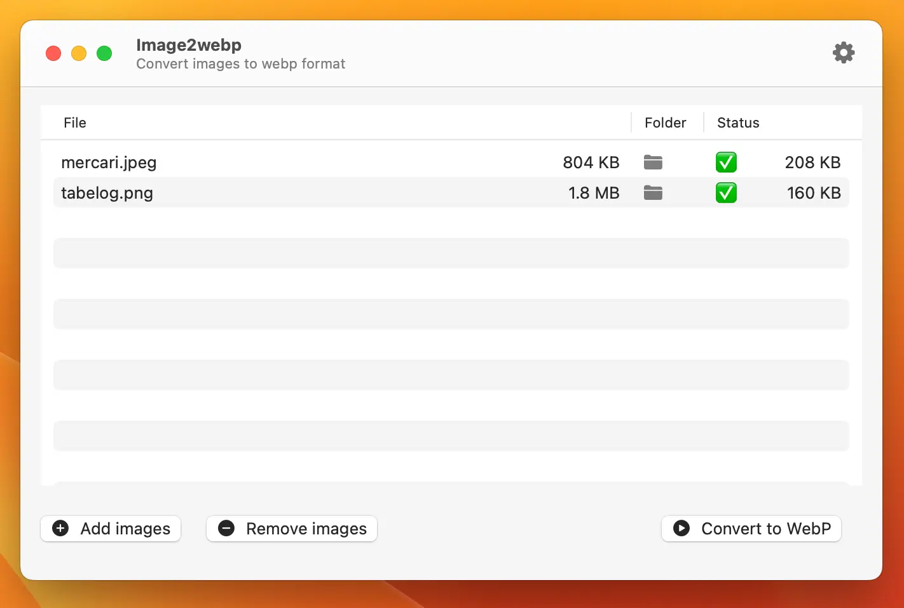

# Image2webp

Convert images to WebP format using the macOS App developed by swiftui.

## Features

- Support jpeg/png/gif to webp conversion
- Support for setting conversion quality
- Support drag and drop to select images
- Support for removing selected images

## Download

[Image2webp](Releases/Image2webp.dmg)

## License

[GPL-3.0 license](LICENSE).
